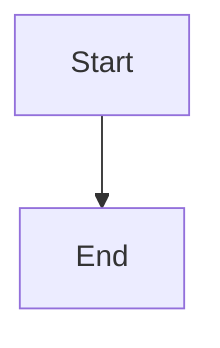

## Overview

The comment components provide enhanced UX features for Hacker News comment threads, including keyboard navigation, inline replies, syntax highlighting, and visual improvements.

## HNComment

Core class representing a single Hacker News comment with methods for interaction and state management.

**Location:** `src/components/comment/hn-comment.ts`

### Constructor

```typescript
const comment = new HNComment(commentRow: HTMLElement)
```

<ParamField path="commentRow" type="HTMLElement" required>
  The DOM element representing the comment row (typically a `<tr>` element with class `athing`)
</ParamField>

### Properties

<ParamField path="id" type="string">
  Unique identifier for the comment
</ParamField>

<ParamField path="commentRow" type="HTMLElement">
  Reference to the comment's DOM element
</ParamField>

<ParamField path="author" type="string | undefined">
  Username of the comment author
</ParamField>

<ParamField path="postedDate" type="string | undefined">
  ISO timestamp when the comment was posted
</ParamField>

### State Methods

```typescript
// Check if comment is collapsed
comment.isCollapsed: boolean

// Check if comment is a collapsed root
comment.isCollapsedRoot: boolean

// Check if comment is hidden as a child
comment.isHiddenChild: boolean

// Check if comment is visible in thread
comment.isVisibleInThread: boolean

// Check if comment is dead/deleted
comment.isDead: boolean
```

### Action Methods

```typescript
// Activate (focus) the comment
comment.activate(): void

// Deactivate (unfocus) the comment
comment.deactivate(): void

// Toggle vote (upvote or downvote)
comment.toggleVote(voteType: 'upvote' | 'downvote'): boolean

// Favorite the comment
comment.favorite(): boolean

// Flag the comment
comment.flag(): boolean

// Open reply form
comment.reply(): HTMLElement | undefined

// Toggle collapse state
comment.collapseToggle(): boolean
```

### Navigation Methods

```typescript
// Get next/previous sibling links
comment.getNextSiblingLink(): HTMLAnchorElement | undefined
comment.getPrevSiblingLink(): HTMLAnchorElement | undefined

// Get reference links from comment text
comment.getReferenceLinks(): Array

// Get indentation level (0 for root comments)
comment.getIndentLevel(): number
```

### Usage Example

```typescript
import { HNComment } from '@/components/comment/hn-comment.ts';

const allComments = document.querySelectorAll('tr.athing');
const hnComments = Array.from(allComments).map(el => new HNComment(el));

// Activate first comment
hnComments[0].activate();

// Upvote the comment
if (hnComments[0].toggleVote('upvote')) {
  console.log('Upvoted successfully');
}
```

---

## CommentData

Manager class for navigating and manipulating a collection of comments.

**Location:** `src/components/comment/comment-data.ts`

### Constructor

```typescript
const commentData = new CommentData(comments: HNComment[])
```

<ParamField path="comments" type="HNComment[]" required>
  Array of HNComment instances to manage
</ParamField>

### Navigation Methods

```typescript
// Get comment by ID
commentData.get(id: string): HNComment | undefined

// Navigate through comments
commentData.getNext(comment: HNComment, skipHidden?: boolean): HNComment | undefined
commentData.getPrevious(comment: HNComment, skipHidden?: boolean): HNComment | undefined

// Get first/last comments
commentData.first(): HNComment | undefined
commentData.last(): HNComment | undefined

// Find closest collapsed comment
commentData.closestCollapsedUp(): HNComment | undefined
commentData.closestCollapsedDown(): HNComment | undefined
```

### Active Comment Management

```typescript
// Get currently active comment
commentData.getActiveComment(): HNComment | undefined

// Activate a comment
await commentData.activate(comment: HNComment): Promise<void>

// Deactivate current comment
await commentData.deactivate(): Promise<void>
```

### Action Methods

```typescript
// Perform actions on active comment
commentData.favorite(): void
commentData.flag(): void
commentData.toggleVote(voteType: 'upvote' | 'downvote'): void
commentData.reply(): HTMLElement | undefined
commentData.collapseToggle(): void
```

### Usage Example

```typescript
import { HNComment } from '@/components/comment/hn-comment.ts';
import { CommentData } from '@/components/comment/comment-data.ts';

const allComments = document.querySelectorAll('tr.athing');
const hnComments = Array.from(allComments).map(el => new HNComment(el));
const commentData = new CommentData(hnComments);

// Activate first comment
const first = commentData.first();
if (first) {
  await commentData.activate(first);
}

// Navigate to next comment
const activeComment = commentData.getActiveComment();
if (activeComment) {
  const next = commentData.getNext(activeComment);
  if (next) {
    await commentData.activate(next);
  }
}
```

---

## Inline Reply

Enables inline comment reply forms without page navigation.

**Location:** `src/components/comment/inline-reply.ts`

### API

```typescript
export const inlineReply = (
  ctx: ContentScriptContext,
  doc: Document
): void
```

<ParamField path="ctx" type="ContentScriptContext" required>
  Content script context for lifecycle management
</ParamField>

<ParamField path="doc" type="Document" required>
  Document object to attach event listeners
</ParamField>

### Features

- Intercepts reply link clicks
- Fetches HMAC token from reply page
- Creates inline reply form with textarea
- Automatically quotes selected text when replying
- Supports toggling reply form visibility

### Usage Example

```typescript
import { inlineReply } from '@/components/comment/inline-reply.ts';

inlineReply(ctx, document);
// Now clicking any "reply" link opens an inline form
```

---

## Keyboard Navigation

Provides keyboard shortcuts for navigating and interacting with comments.

**Location:** `src/components/comment/keyboard-navigation.ts`

### API

```typescript
export const keyboardNavigation = async (
  ctx: ContentScriptContext,
  doc: Document,
  commentElements: HTMLElement[],
  commentData: CommentData,
  navState?: KeyboardNavState
): Promise<void>
```

### Keyboard Shortcuts

| Key | Action |
|-----|--------|
| `j` / `J` | Move to next comment |
| `k` / `K` | Move to previous comment |
| `u` | Upvote active comment |
| `d` | Downvote active comment |
| `r` | Reply to active comment |
| `f` | Favorite active comment |
| `Shift+X` | Flag active comment |
| `c` | Collapse/expand active comment |
| `n` | Navigate to next sibling |
| `p` | Navigate to previous sibling |
| `0-9` | Open reference link by number |
| `t` | Scroll to top |
| `b` | Go back in browser history |
| `Esc` | Deactivate comment or close reply form |

### Usage Example

```typescript
import { keyboardNavigation } from '@/components/comment/keyboard-navigation.ts';
import { CommentData } from '@/components/comment/comment-data.ts';
import { HNComment } from '@/components/comment/hn-comment.ts';

const allComments = document.querySelectorAll('tr.athing');
const hnComments = Array.from(allComments).map(el => new HNComment(el));
const commentData = new CommentData(hnComments);

await keyboardNavigation(ctx, document, allComments, commentData);
```

---

## Backticks to Code

Converts backtick-wrapped text to `<code>` tags for syntax highlighting.

**Location:** `src/components/comment/backticks-to-code.ts`

### API

```typescript
export const backticksToCode = (
  _doc: Document,
  comments: HTMLElement[]
): void
```

### Usage Example

```typescript
import { backticksToCode } from '@/components/comment/backticks-to-code.ts';

const allComments = document.querySelectorAll('tr.athing');
backticksToCode(document, Array.from(allComments));
// Now `code` renders as <code>code</code>
```

---

## Highlight Unread Comments

Highlights new comments since last visit with colored indent bar.

**Location:** `src/components/comment/highlight-unread-comments.ts`

### API

```typescript
export const highlightUnreadComments = async (
  doc: Document,
  comments: HTMLElement[],
  manager: ServicesManager
): Promise<void>
```

<ParamField path="doc" type="Document" required>
  Document object for styling
</ParamField>

<ParamField path="comments" type="HTMLElement[]" required>
  Array of comment elements
</ParamField>

<ParamField path="manager" type="ServicesManager" required>
  Services manager for storage access
</ParamField>

### Features

- Tracks visited comments per story
- Adds orange indent bar to new comments
- Auto-expires stored data after 3 days
- Dark mode support

---

## Indent Toggle

Makes comment indent bars clickable to collapse/expand threads.

**Location:** `src/components/comment/indent-toggle.ts`

### API

```typescript
export const indentToggle = (
  ctx: ContentScriptContext,
  doc: Document,
  comments: HTMLElement[]
): void
```

### Features

- Converts indent cells to clickable areas
- Visual hover feedback
- Delegates to native collapse toggle

---

## Collapse Root

Adds "[collapse root]" link to nested comments for quick navigation.

**Location:** `src/components/comment/collapse-root.ts`

### API

```typescript
export const collapseRoot = (
  ctx: ContentScriptContext,
  doc: Document,
  comments: HTMLElement[],
  commentData: CommentData
): void
```

### Features

- Adds collapse link to nested comments
- Collapses root comment in thread
- Activates and scrolls to root comment

---

## Beautiful Mermaid

Renders Mermaid diagrams in comments with live preview in reply forms.

**Location:** `src/components/comment/beautiful-mermaid.ts`

### API

```typescript
export const commentBeautifulMermaid = async (
  ctx: ContentScriptContext,
  doc: Document,
  comments: HNComment[]
): Promise<void>
```

### Features

- Renders Mermaid diagrams in `<pre><code>` blocks
- Live preview while typing in reply forms
- Automatic theme detection (light/dark mode)
- Error handling with user feedback

### Usage Example

In a comment, write:
```

```

The diagram renders automatically as an SVG.